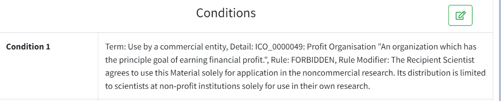
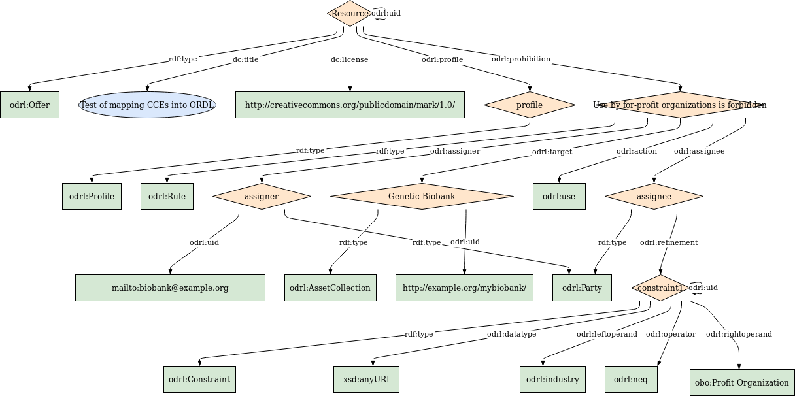

# DUC-CCE
Tools, templates, examples, and validators/schema for the creation of Digital Use Conditions (DUC) Profiles with Common Conditions of Use Elements (CCE)

# CCE RULE


<br/>


# OUTPUT (diagram)



<br/>

# OUTPUT (JSON-LD)

```
{
  "@context": {
    "rdf": "http://www.w3.org/1999/02/22-rdf-syntax-ns#",
    "rdfs": "http://www.w3.org/2000/01/rdf-schema#",
    "odrl": "http://www.w3.org/ns/odrl/2/",
    "this": "http://w3id.org/FAIR_Training_LDP/DAV/home/LDP/DUC-CCE/EXAMPLE#",
    "obo": "http://purl.obolibrary.org/obo/",
    "xsd": "http://www.w3.org/2001/XMLSchema#"
  },
  "@graph": [
    {
      "@id": "http://w3id.org/FAIR_Training_LDP/DAV/home/LDP/DUC-CCE/EXAMPLE",
      "@type": "odrl:Offer",
      "odrl:uid": {
        "@id": "http://w3id.org/FAIR_Training_LDP/DAV/home/LDP/DUC-CCE/EXAMPLE"
      },
      "odrl:profile": {
        "@id": "this:profile"
      },
      "http://purl.org/dc/terms/title": {
        "@language": "en",
        "@value": "Test of mapping CCEs into ORDL"
      },
      "http://purl.org/dc/terms/license": {
        "@id": "http://creativecommons.org/publicdomain/mark/1.0/"
      },
      "odrl:prohibition": {
        "@id": "this:rule1"
      }
    },
    {
      "@id": "this:profile",
      "@type": "odrl:Profile"
    },
    {
      "@id": "this:rule1",
      "@type": "odrl:Rule",
      "odrl:target": {
        "@id": "this:asset"
      },
      "odrl:action": {
        "@id": "odrl:use"
      },
      "odrl:assigner": {
        "@id": "this:assigner"
      },
      "odrl:assignee": {
        "@id": "this:assignee"
      },
      "rdfs:label": {
        "@language": "en",
        "@value": "Use by for-profit organizations is forbidden"
      }
    },
    {
      "@id": "this:asset",
      "odrl:uid": {
        "@id": "http://example.org/biobank/"
      },
      "@type": "odrl:AssetCollection",
      "rdfs:label": {
        "@language": "en",
        "@value": "Genetic Biobank"
      }
    },
    {
      "@id": "this:assigner",
      "@type": "odrl:Party",
      "odrl:uid": {
        "@id": "mailto:biobank@example.org"
      }
    },
    {
      "@id": "this:assignee",
      "@type": "odrl:Party",
      "odrl:refinement": {
        "@id": "this:constraint1"
      }
    },
    {
      "@id": "this:constraint1",
      "@type": "odrl:Constraint",
      "odrl:uid": {
        "@id": "this:constraint1"
      },
      "odrl:datatype": {
        "@id": "xsd:anyURI"
      },
      "odrl:leftOperand": {
        "@id": "odrl:industry"
      },
      "odrl:rightOperand": {
        "@id": "obo:ICO_0000049"
      },
      "odrl:operator": {
        "@id": "odrl:neq"
      }
    },
    {
      "@id": "obo:ICO_0000049",
      "rdfs:label": {
        "@language": "en",
        "@value": "Profit Organization"
      }
    }
  ]
}

```
 
